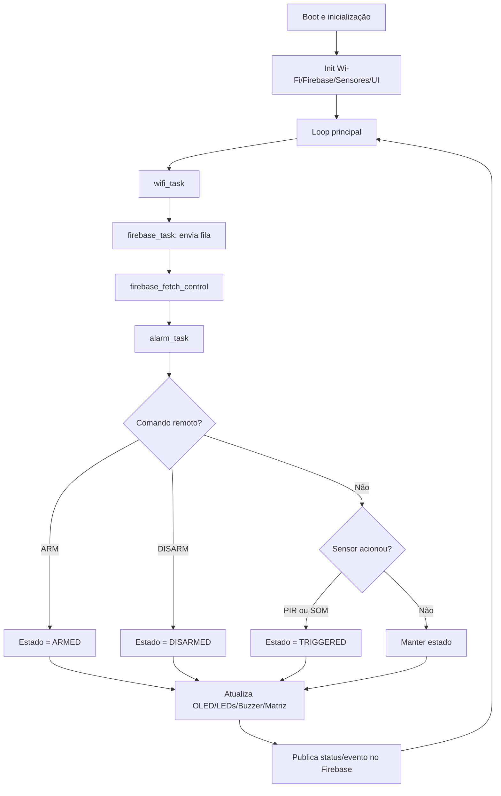

# Relatório Técnico — Sistema de Alarme IoT Embarcado (BitDogLab + Pico W) - ALENCAR JÚNIOR

## a) Apresentação

Este projeto implementa uma solução embarcada de alarme IoT utilizando Raspberry Pi Pico W, com monitoramento local (OLED, matriz de LEDs, buzzer e LED RGB) e integração em nuvem com Firebase Realtime Database.

### Desafio tratado

O desafio principal é construir um sistema de segurança residencial/laboratorial de baixo custo capaz de:

- detectar intrusão por movimento (PIR) e/ou ruído (microfone em ADC);
- reagir localmente em tempo real com alarmes sonoros/visuais;
- sincronizar estado e eventos com a nuvem;
- receber comandos remotos (armar/desarmar) com segurança via TLS.

### Contexto e motivação

No contexto de IoT educacional/prototipagem, muitos projetos tratam sensores e alarmes de forma isolada. A motivação aqui foi consolidar em um único firmware:

1. aquisição de sinais físicos;
2. lógica de controle por estados;
3. interface homem-máquina local;
4. integração remota segura para supervisão e comando.

---

## b) Objetivos

### Objetivo geral

Desenvolver um sistema embarcado de alarme inteligente com conectividade Wi-Fi, interface local multimodal e integração com Firebase para telemetria e controle remoto.

### Objetivos específicos

1. Detectar eventos de **movimento** e **som** com confiabilidade e baixa latência.
2. Implementar máquina de estados de alarme (`DISARMED`, `ARMED`, `TRIGGERED`).
3. Fornecer feedback local por OLED, matriz WS2812, LED RGB e buzzer.
4. Publicar status/eventos no Firebase e consumir comandos remotos.
5. Garantir comunicação segura com TLS no Pico W.
6. Estruturar o firmware de forma modular para facilitar manutenção e evolução.

---

## c) Requisitos funcionais

### Entradas

- Sensor PIR (detecção de movimento digital).
- Sinal de áudio analógico via ADC (detecção acústica).
- Botões físicos A/B.
- Joystick (eixos X/Y e botão).
- Comando remoto em Firebase (`desired_state`).

### Saídas

- Atualização de status em OLED.
- Padrões visuais na matriz WS2812.
- Sinalização por LED RGB (PWM).
- Alarme sonoro por buzzer (PWM).
- Publicação de status e eventos no Firebase.

### Regras/condições de operação

1. O sistema deve operar em ciclo contínuo com watchdog ativo.
2. O estado do alarme deve refletir entradas locais e remotas.
3. A detecção de som deve usar limiar dinâmico para reduzir falso positivo.
4. O dispositivo deve tolerar indisponibilidade temporária de rede e retentar envio.
5. Os comandos remotos devem considerar timestamp (`updated_at`) para evitar replay lógico.

### Restrições

- Recursos limitados do microcontrolador (RAM/CPU).
- Dependência de conectividade Wi-Fi para sincronização remota.
- Sensibilidade do microfone e ruído ambiente impactam calibração.

---

## d) Arquitetura de hardware

### Microcontrolador e comunicação

- **Raspberry Pi Pico W (RP2040 + CYW43)**: núcleo de processamento e Wi-Fi.

### Sensores

- **PIR** (movimento), ligado a GPIO digital.
- **Microfone analógico** no ADC para detecção de ruído.

### Atuadores/Interface local

- **OLED SSD1306** (I2C) para mensagens e estado.
- **Matriz WS2812 5x5** (PIO) para padrões visuais.
- **LED RGB** controlado por PWM.
- **Buzzer** controlado por PWM.

### Entradas de usuário

- **Botões A/B**.
- **Joystick analógico + botão**.

### Mapeamento de pinos (configuração atual)

- PIR: GP8
- Áudio ADC: GP28
- Botões: GP5 (A), GP6 (B)
- Joystick: GP26 (X), GP27 (Y), GP22 (botão)
- LED RGB: GP13 (R), GP11 (G), GP12 (B)
- Matriz WS2812: GP7
- Buzzer: GP21
- OLED I2C: SDA GP14, SCL GP15

---

## e) Arquitetura do firmware

O firmware é modular e organizado em serviços de aquisição, controle, interface e comunicação.

### Módulos principais

- `projeto_final.c`: inicialização global e loop principal.
- `wifi.c`: gerenciamento de conectividade.
- `firebase.c`: cliente TLS, fila de eventos e polling de controle remoto.
- `alarm.c`: máquina de estados, regras de transição e atuação local.
- `audio.c`: processamento de áudio (baseline, ruído e trigger).
- `pir.c`: detecção de movimento por interrupção.
- `display.c` + `ssd1306.c`: renderização no OLED.
- `matrix.c` + `ws2812.pio`: controle de matriz de LEDs.
- `buttons.c`/`joystick.c`: interface de entrada local.
- `control.c`: buffer de comandos remotos pendentes.

### Interação entre módulos (resumo)

1. `wifi_task()` mantém conectividade.
2. `firebase_task()` envia fila de status/eventos.
3. `firebase_fetch_control()` consulta comando remoto.
4. `alarm_task()` coleta sensores + comando pendente e decide estado.
5. Ao mudar estado, o sistema atualiza display, matriz, buzzer/LED e Firebase.

---

## f) Fluxograma

---

## g) Indicação do uso de IA

Ferramentas de IA foram utilizadas como apoio técnico em atividades de:

1. **Produção textual**: organização e revisão da redação técnica (clareza, estrutura e padronização).
2. **Apoio de desenvolvimento**: sugestão de ajustes de código, documentação e integração entre módulos.
3. **Estruturação de documentação**: auxílio na elaboração de README, definição de seções e exemplos de payload.
4. **Síntese técnica**: apoio para consolidar arquitetura, requisitos e fluxo de execução em formato didático.

A IA foi usada como ferramenta assistiva. As decisões finais de engenharia (pins, regras de estado, contrato de dados e execução) foram validadas no contexto do projeto.

---

## h) Conclusão

### Resultados alcançados

- Sistema de alarme embarcado com entradas múltiplas (PIR + áudio).
- Controle por máquina de estados com interface local rica (OLED + WS2812 + LED RGB + buzzer).
- Comunicação remota com Firebase via TLS e suporte a comandos remotos.
- Estrutura modular de firmware que facilita evolução incremental.

### Dificuldades encontradas

- Ajuste fino de detecção sonora em ambientes com ruído variável.
- Complexidade de integração TLS/lwIP em recursos limitados.
- Necessidade de manter compatibilidade de contrato de dados com o app Flutter.

### Melhorias futuras

1. Migrar parte do áudio para ADC + DMA para reduzir carga de CPU e melhorar robustez.
2. Implementar testes automatizados (unitários de parsing/estados e integração simulada).
3. Incluir política de filas/retentativas mais avançada para rede instável.
4. Publicar documentação dedicada da aplicação Flutter e checklist de deploy.
5. Adicionar métricas de saúde do dispositivo (uptime, RSSI, watchdog resets).
